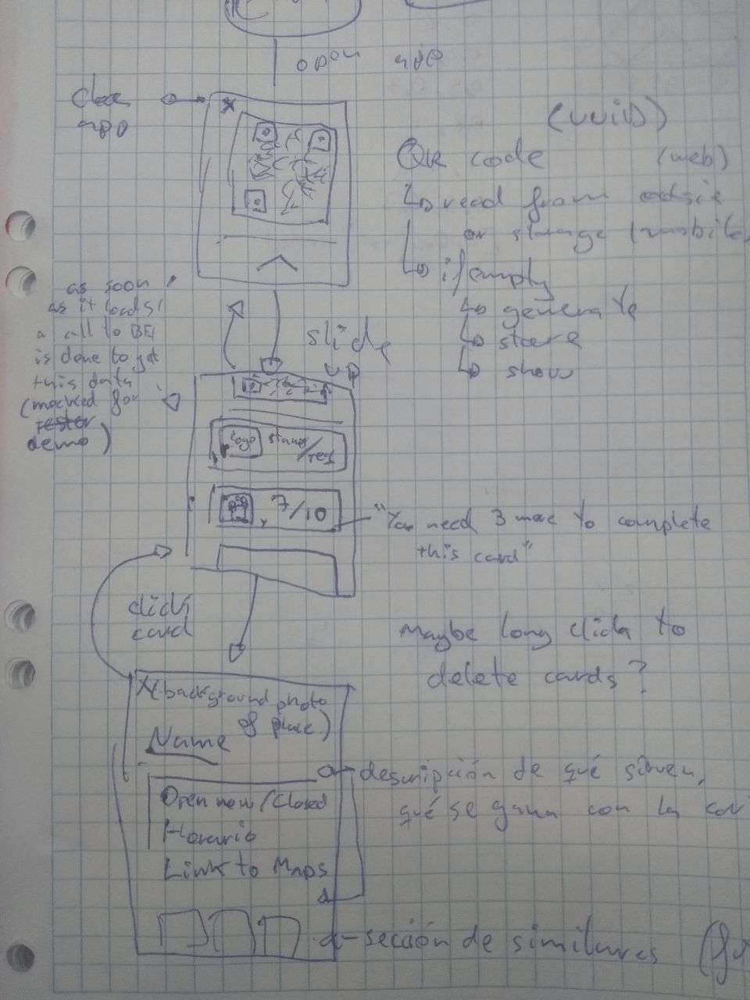

# QR loyalty card

## The "problem"

A friend of mine saw me use a loyalty card in a coffee shop.
He told me he thinks it's uncomfortable
to carry a bunch of paper cards around
just in case he'll go to that place.
So he usually doesn't have the card when he needs it.
This is an attempt to "solve" that problem with an app.

## The idea

My main concern when using apps like these
is they are incredibly slow to load.
And most of the times
you have to navigate and open some menus,
which are also slow,
before you can find the QR code.
To avoid that, the user will have a locally generated UUID
and that will be stored in the device's storage.
Everything stays in the device,
then gets registered in the backend later.

The main screen is just a QR code with the user id.
This should make the app super fast to load. 
No login, no backend calls required before rendering.

### "Stamping" the card / usage

The store owner should scan the code 
with a phone/physical scanner 
that sends a message to the backend. 
This should respond with 
whether or not the user completed their loyalty card.
And the value should be updated in the backend.

### Retrieve account

Since the id is stored locally,
users will lose their data if they uninstall the app.
There should be an option to create an account
so they can retrieve this id from the backend later.
When they log in, the app can store the id
to use it the next time it starts up.

### Checking user card

If the user scrolls down on the main screen
they will see a list of stores they use the app with.
These show an image for the logo/picture of that store
as well as the store name.
They also show how many stamps the user collected
and how many remain before completing the card.

Ideally the user should be able to click on that card,
opening a screen with information about the store.
Name, description, an "Open now/Closed" indicator,
maybe a schedule and definitely a location link to Maps.

